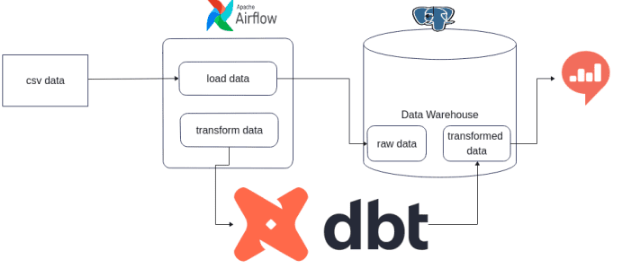
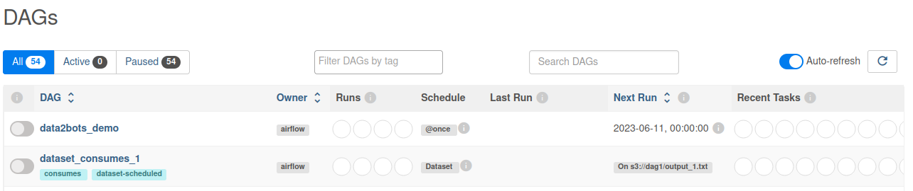
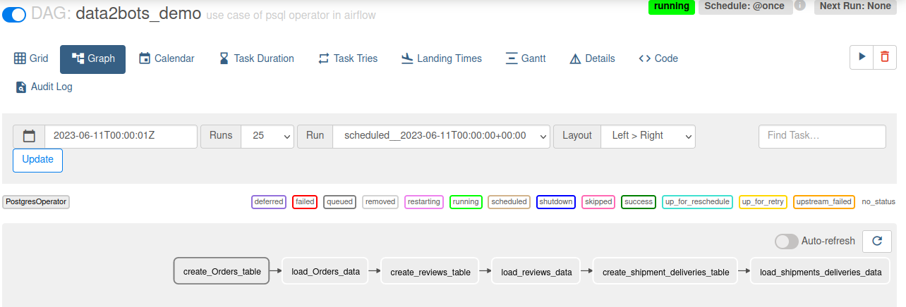
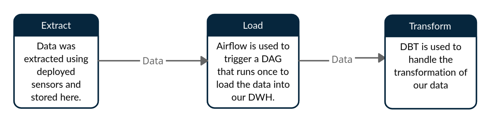

#  Data2bots Scalable DataWarehouse

<!-- Table of contents -->
- [Objectives](#objectives)
- [Repository overview](#repository-overview)
- [Requirements](#requirements)
- [Usage](#usage)
  - [Docker-compose](#docker-compose)
- [Contrbutor](#contrbutors)

## Objectives
The objective of this project is to build an ELT pipeline (batch or streaming) that loads the business data in to the data2bots data warehouse and performs the transformation.

## Repository overview
 Structure of the repository:
 
        ├── dags  (airflow scripts containing the dags)
        ├── screenshots  (Important screenshots)
        ├── postgres_data  (dbt configrations and models)
        ├── data    (contains data)
        ├── scripts (contains the main script)
        │   ├── Extract_data.py (Data Extraction from the data source(S3))
        ├── notebooks	
        │   ├── EDA.ipynb (overview of the Data)
        ├── README.md (contains the project description)
        ├── requirements.txt (contains the required packages)
        └── .dvc (contains the dvc configuration)

## Requirements
The project requires the following:
- python3
- Pip3
- docker
- docker-compose

## Tools
1. Docker
2. Airflow
3. postgres

## Usage
### Docker-compose
All of the project dependecies are installed using docker-compose. The docker-compose file is located in the root directory.
Steps to setup the project:
1. create a .env file and add the required configurations
  ```

AIRFLOW_UID=<your_uid>
AIRFLOW_GID=<your_gid>
DB_HOST_DEV=<your_db_host>
DB_PORT_DEV=<your_db_port>
DB_USER_DEV=<your_db_user>
DB_PASSWORD_DEV=<your_db_password>
DB_NAME_DEV=<your_db_name>

<!-- AIRflow -->
SMTP_HOST=<your_smtp_host>
SMTP_PORT=<your_smtp_port>
SMTP_USER=<your_smtp_user>
SMTP_PASSWORD=<your_smtp_password>

  ```
2. Run `docker-compose up airflow-init` to initialize airflow user.
3. Run `docker-compose up -d` to start the project and visit localhost:8080 in your browser to access airflow admin.
4. Run `docker exec <dbt-cli-id> /bin/bash` to execute dbt commands.
5. Run `docker-compose down` to stop the project.

### workflow


## DAGS


## Approach
- ELT



## Contrbutor
- Tegisty Hailay Degef
